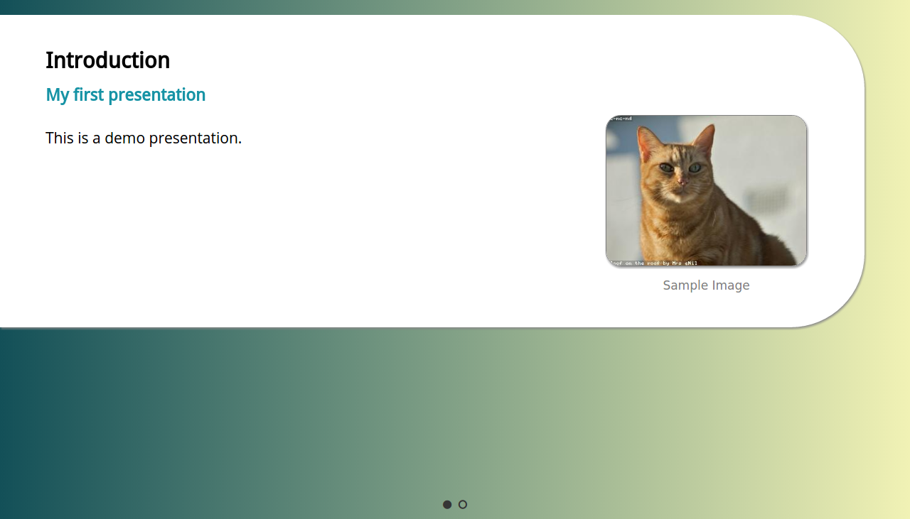

Simple Web Presentation
---

**Quickly create simple web presentations.**

*Simplifies the process to just writing a few lines of JSON.*

*Responsive design makes your presentation look good on small and large screens.*

*Automatic favicon creation based on presentation background.*


**Getting Started**

Clone this repo

```
git clone https://github.com/thurt/simple-web-presentation
```

Go to the cloned directory

```
cd simple-web-presentation
```
Install the compile-time dependencies
```
npm install
```

Compile the presentation

```
npm run compile
```
The compilation process creates an `index.html` file in the root directory. This file is your presentation.

Start up your web browser and open your presentation. You will see that your presentation was compiled with sample data.



To start creating your own presentation, make modifications to `compile/presentation-data.json`. Then compile again.

**Presentation Data Guidelines**

Inside `presentation-data.json`, you **must** specify:
* `author` - your name
* `description` - a short description about the contents of your presentation
* `title` - the presentation's title
* `theme` - filepath or uri to css file
* `bg-start-color` & `bg-end-color` - should be hex color codes. They specify what colors will be used for the presentation's background and for the auto-generated favicon.
* `slides` - should be an array of slide objects

Inside each slide object, you may **optionally** specify:
* `heading` - text
* `sub-heading` text
* `img` - filepath or uri to an image file
* `img-caption` - text description for the image
* `contents` - an array of content objects

Each content object should contain only one key-value pair.
```
// Examples
content: [
  { "p": "This content object will become a paragraph element with this text inside."},
  { "h3": "This content object will become a heading element with this text inside."},
  { "ul": [
    "This content object will become an unordered list element",
    "Here is a second list item"
  ] }
]
```
Usually, `p` will be the most common key used for your content objects.

The only special case is when the key is `ul` or `ol`--in that case the value must be an array of strings (see example above).

**Themes**

`default.theme.css` is the only available theme right now.

**Extra Tips**

Use http://uigradients.com to help you choose background colors that fits your presentation.
